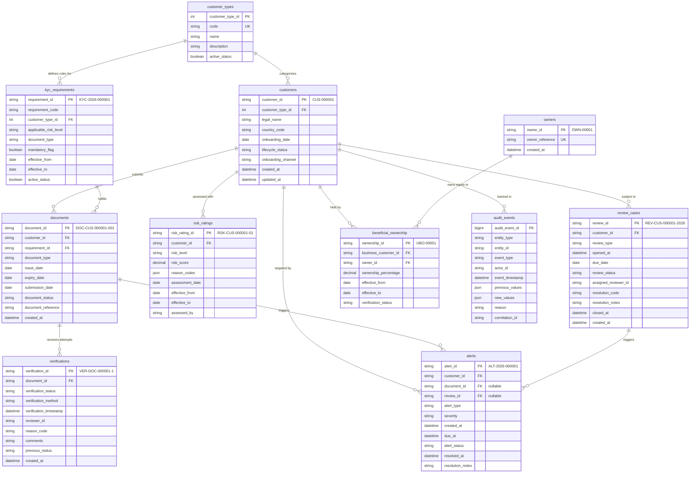

# KYC Onboarding & Compliance Management System - Entity Relationship Diagram

```mermaid
erDiagram
    customer_types ||--o{ customers : "categorizes"
    customer_types ||--o{ kyc_requirements : "defines rules for"
    customers ||--o{ documents : "submits"
    kyc_requirements ||--o{ documents : "fulfills"
    documents ||--o{ verifications : "receives attempts"
    customers ||--o{ risk_ratings : "assessed with"
    customers ||--o{ review_cases : "subject to"
    customers ||--o{ beneficial_ownership : "held by"
    owners ||--o{ beneficial_ownership : "owns equity in"
    customers ||--o{ alerts : "targeted by"
    documents ||--o{ alerts : "triggers"
    review_cases ||--o{ alerts : "triggers"
    customers ||--o{ audit_events : "tracked in"

    customer_types {
        int customer_type_id PK
        string code UK
        string name
        string description
        boolean active_status
    }

    customers {
        string customer_id PK "CUS-000001"
        int customer_type_id FK
        string legal_name
        string country_code
        date onboarding_date
        string lifecycle_status
        string onboarding_channel
        datetime created_at
        datetime updated_at
    }

    kyc_requirements {
        string requirement_id PK "KYC-2026-000001"
        string requirement_code
        int customer_type_id FK
        string applicable_risk_level
        string document_type
        boolean mandatory_flag
        date effective_from
        date effective_to
        boolean active_status
    }

    documents {
        string document_id PK "DOC-CUS-000001-001"
        string customer_id FK
        string requirement_id FK
        string document_type
        date issue_date
        date expiry_date
        date submission_date
        string document_status
        string document_reference
        datetime created_at
    }

    verifications {
        string verification_id PK "VER-DOC-000001-1"
        string document_id FK
        string verification_status
        string verification_method
        datetime verification_timestamp
        string reviewer_id
        string reason_code
        string comments
        string previous_status
        datetime created_at
    }

    risk_ratings {
        string risk_rating_id PK "RSK-CUS-000001-01"
        string customer_id FK
        string risk_level
        decimal risk_score
        json reason_codes
        date assessment_date
        date effective_from
        date effective_to
        string assessed_by
    }

    review_cases {
        string review_id PK "REV-CUS-000001-2026"
        string customer_id FK
        string review_type
        datetime opened_at
        date due_date
        string review_status
        string assigned_reviewer_id
        string resolution_code
        string resolution_notes
        datetime closed_at
        datetime created_at
    }

    owners {
        string owner_id PK "OWN-00001"
        string owner_reference UK
        datetime created_at
    }

    beneficial_ownership {
        string ownership_id PK "UBO-00001"
        string business_customer_id FK
        string owner_id FK
        decimal ownership_percentage
        date effective_from
        date effective_to
        string verification_status
    }

    alerts {
        string alert_id PK "ALT-2026-000001"
        string customer_id FK
        string document_id FK "nullable"
        string review_id FK "nullable"
        string alert_type
        string severity
        datetime created_at
        datetime due_at
        string alert_status
        datetime resolved_at
        string resolution_notes
    }

    audit_events {
        bigint audit_event_id PK
        string entity_type
        string entity_id
        string event_type
        string actor_id
        datetime event_timestamp
        json previous_values
        json new_values
        string reason
        string correlation_id
    }
```
